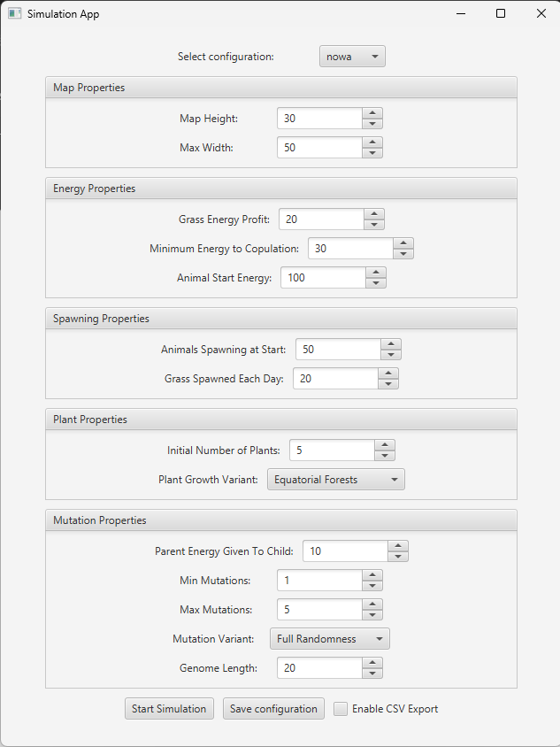
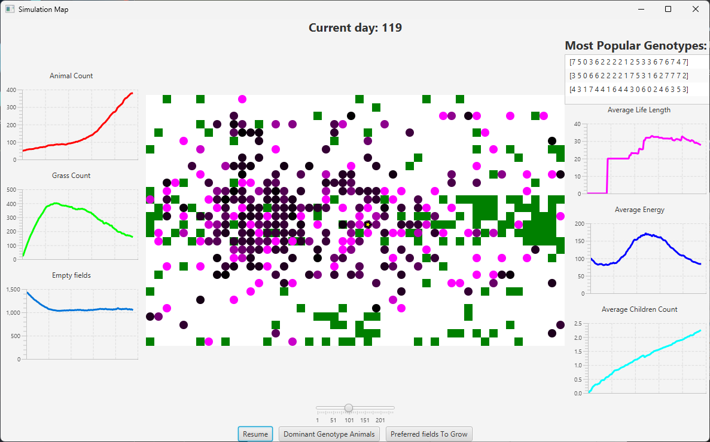

# Darwin World 🌍🐾

Darwin World repository, is a project created as part of the Object-Oriented
Programming (OOP) Course at AGH UST.
It's goal was to crystallize the knowledge of OOP programming
by creating a self-playing simulation of an ecosystem.

## Authors ✍️

- [**Piotr Karamon**](https://github.com/pkaramon) - *model and small bits of GUI* 
- [**Nikodem Adamczyk**](https://github.com/nikodemadamczyk)- *GUI*

## About the Project 📖

Darwin World is an application that simulates an evolving ecosystem.
The ecosystem consists of a 2D grid, where the only entities are animals and plants.
Animals are able to move, reproduce and die, while plants are stationary and serve as a food source.
Each animal has a unique set of genes that determine its movement.
When animals reproduce, their children inherit a mix of their parents' genes, with a chance of mutation.
The simulation is run in real-time, with the user able to observe the ecosystem as it evolves over time.

## Features 🌟

- **Selecting simulation parameters**: Users can customize the simulation by setting the grid size, initial animal count, mutation type and other parameters.
- **Importing and exporting simulation parameters**: The simulation parameters can be saved to a file and loaded later.
- **Drawing the current state of simulation**: The simulation is visualized in real-time, showing the grid, animals and plants.
- **Tracking statistics**: Users can monitor the population statistics, such as the number of animals, average energy and average lifespan.
- **Exporting statistics to a CSV file**: Users can choose to save the statistics to a CSV file for further analysis.

## Technologies 💻

- **Java**: The core programming language used to implement the Darwin World simulation.
- **JavaFX**: The GUI library used to create the user interface for the application.
- **JUnit 5**: The testing framework used to write unit and integration tests for the application.
- **Gradle**: The build automation tool used to manage dependencies and build the application.
- **jackson**: The library used to serialize and deserialize JSON files containing simulation parameters.

## Images 📸

### Configruation Panel

### Running Simulation

